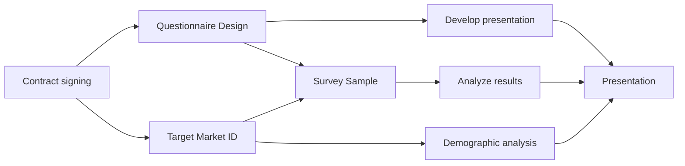

> 📢 Disclaimer
> Copyright © [The Hong Kong Polytechnic University, Faculty of Engineering, Department of Industrial & Systems Engineering](https://www.polyu.edu.hk/ise/)
> The lecture notes is for reference only, permission is hereby granted, free of charge, to any person obtaining a copy of this documentation file, to deal in the Page without restriction, including without limitation the rights to use, copy, modify, merge, publish, distribute, sublicense, and/or sell copies of the Software, and to permit persons to whom the Page is furnished to do so.
> The authors or copyright holders are not be liable for any claim, damages or other liabillty, whether in an action of contract, tort or otherwise, arising from, out of or in connection with or the use or other dealings in the Page.

<!-- 
TABLE OF CONTENT
- [Lecture 1 INTRODUCTION](#lecture-1-introduction)
  - [1.1 Project definition](#11-project-definition)
  - [1.2 Distinguished features of projects](#12-distinguished-features-of-projects)
  - [1.3 Differences between operation and project](#13-differences-between-operation-and-project)
  - [1.4 Project life cycles – Four stages](#14-project-life-cycles--four-stages)
  - [1.5 Dynamic factors in projects](#15-dynamic-factors-in-projects)
  - [1.6 Constraints of project – Iron Triangle](#16-constraints-of-project--iron-triangle)
  - [1.7 Four dimensions of project success](#17-four-dimensions-of-project-success)
  - [1.8 Project management](#18-project-management)
  - [1.9 Useful charts in PM](#19-useful-charts-in-pm)
    - [1.9.1 Gantt Chart](#191-gantt-chart)
    - [1.9.2 Flow Chart](#192-flow-chart)
    - [1.9.3 Work Breakdown Structure (WBS)](#193-work-breakdown-structure-wbs)
    - [1.9.4 Pareto Chart](#194-pareto-chart)
    - [1.9.5 SWOT Analysis](#195-swot-analysis)
    - [1.9.6 Matrix Diagram](#196-matrix-diagram)
- [Lecture 2 PROJECT MANAGEMENT PROCESS](#lecture-2-project-management-process)
  - [2.1 Initiating processes](#21-initiating-processes)
  - [2.2 Planning processes](#22-planning-processes)
    - [2.2.1 Core planning](#221-core-planning)
    - [2.2.2 Facilitating planning](#222-facilitating-planning)
  - [2.3 Executing processes](#23-executing-processes)
  - [2.4 Controlling processes](#24-controlling-processes)
  - [2.5 Closing processes](#25-closing-processes)
  - [2.6 The hierarchy of project management in organizations](#26-the-hierarchy-of-project-management-in-organizations)
    - [2.6.1 Functional organizations](#261-functional-organizations)
    - [2.6.2 Project organizations](#262-project-organizations)
    - [2.6.3 Matrix organizations](#263-matrix-organizations)
- [Lecture 3 PROJECT SELECTION](#lecture-3-project-selection)
  - [3.1 Checklist model](#31-checklist-model)
  - [3.2 Simplified scoring model](#32-simplified-scoring-model)
  - [3.3 Pairwise comparison approach](#33-pairwise-comparison-approach)
  - [3.4 The analytical hierarchy process (AHP)](#34-the-analytical-hierarchy-process-ahp)
  - [3.5 Profile model](#35-profile-model)
  - [3.6 Financial models](#36-financial-models)
- [Lecture 4 PROJECT SCOPE MANAGEMENT](#lecture-4-project-scope-management)
  - [Project Requirements](#project-requirements)
  - [Project Progress](#project-progress)
- [Lecture 5 PROJECT SCHEDULING](#lecture-5-project-scheduling)
  - [Critical Path Method](#critical-path-method)
  - [Critical Path](#critical-path)
  - [Activity-on-Node (AON)](#activity-on-node-aon)
- [Lecture 6 PROJECT CRASHING](#lecture-6-project-crashing)
- [Lecture 7 PROJECT EVALUATION AND CONTROL](#lecture-7-project-evaluation-and-control)
  - [Tools](#tools)
    - [Project S-Curve: Simplicity](#project-s-curve-simplicity)
    - [Milestone Analysis: Tracking Gantt Charts](#milestone-analysis-tracking-gantt-charts)
    - [Earned Value](#earned-value)
- [Presentation](#presentation)
- [Lecture 8 RISK MANAGEMENT](#lecture-8-risk-management)
  - [8.1 Define project risk](#81-define-project-risk)
  - [8.2 Recognize four key stages in project risk management](#82-recognize-four-key-stages-in-project-risk-management)
  - [8.3 Understand five primary causes of project risk and four major approaches to risk identification](#83-understand-five-primary-causes-of-project-risk-and-four-major-approaches-to-risk-identification)
    - [Risk identification](#risk-identification)
    - [Analysis of probability and consequences](#analysis-of-probability-and-consequences)
  - [8.4 Recognize risk mitigation strategies](#84-recognize-risk-mitigation-strategies)
    - [Use of Contingency Reserves](#use-of-contingency-reserves)
    - [Task Contingency](#task-contingency)
    - [Managerial Contingency](#managerial-contingency)
    - [Other Mitigation Strategies](#other-mitigation-strategies)
- [Lecture 9 Cost Estimation and Budgeting](#lecture-9-cost-estimation-and-budgeting)
  - [Common sources](#common-sources)
  - [Cost Classification](#cost-classification)
    - [Direct vs Indirect](#direct-vs-indirect)
  - 
    - [Recurring vs Nonrecurring Costs](#recurring-vs-nonrecurring-costs)
    - [Fixed vs Variable Costs](#fixed-vs-variable-costs)
    - [Normal vs Expedited Costs](#normal-vs-expedited-costs)
  - [Cost Estimation](#cost-estimation)
  - [Learning Curves](#learning-curves)
  - [Software Project Estimation  -- Functional Points](#software-project-estimation-----functional-points)
  - [Project Budget](#project-budget)
- [Lecture 10 Resources Management](#lecture-10-resources-management)
  - [Basics of Resource Constraints](#basics-of-resource-constraints)
  - [Time and Resource Scarcity](#time-and-resource-scarcity)
  - [Resource-loading chart](#resource-loading-chart)
    - [Step one: develop the resource-loading table](#step-one-develop-the-resource-loading-table)
    - [Step two: determine activity late Finish dates](#step-two-determine-activity-late-finish-dates)
    - [Step three: identify resource overallocation](#step-three-identify-resource-overallocation)
    - [Step Four: level the resource-loading table](#step-four-level-the-resource-loading-table) -->

# Lecture 1 INTRODUCTION

Analyze the reasons behind the delay from different perspectives, for example,
1. from engineering's perspective, it is an amazing project
2. but from manager's perspective, they would value on the whole process 

## 1.1 Project definition

1. Unique objective
• Have a specific objective to be completed within certain specifications
• E.g., Create a physical/virtual product (e.g., a building, a mobile app, music, a vehicle)
• E.g., Provide managerial insights (e.g., impact/cause investigation, feasibility analysis)
2. Time constrained
• Have defined start and end dates 
3. Resource constrained
• Consume human and nonhuman resources (i.e., money, people, equipment)

## 1.2 Distinguished features of projects 

Change
• Projects are the means by which we introduce change 
• Temporary
• Projects are temporary in nature. Once the desired change has been implemented, business as usual resumes (in its new form) and the need for the project is removed.
introduce a change that will impact others outside the team.
and budget overrun is not for sure.

• Cross-functional
• Projects involve a team of people with different skills working together to • Uncertain
• Projects are full of uncertainties. Reaching the target objective without delays • Stakeholder-focused
• The primary purpose of conducting a project is to satisfy stakeholder needs.

---

## 1.3 Differences between operation and project
||Operation|Project|
|:--|:--|:--|
|process or product|repeat|new|
|people|homogeneous|heterogeneous|
|time period|ongoing|one shot - limited life|
|system|in place to integrate efforts|must be created to integrate efforts|
|performance, cost, & time known|certain|less certain|
|established practice|follows|violates|
|status quo|support|upset|

Objectives: general and broad-wise
Deliverables: a specific products/ services 

---

## 1.4 Project life cycles – Four stages
• Stage 1 - Conceptualization (initialization)
• Develop the initial goal and technical specifications for a project 
• Determine resources (people, money, physical plant), and stakeholders
• Stage 2 - Planning
• All detailed work scope, schedules, and other plans are developed
• Stage 3 - Execution
• The actual “work” of the project is performed, and the costs are mainly spent here
• Stage 4 - Termination
• The completed project is transferred to the customer, its resources reassigned, and the project formally closed out

---

## 1.5 Dynamic factors in projects
• Client interest • Project stake • Resource consumption • Creativity • Uncertainty

---

## 1.6 Constraints of project – Iron Triangle
Triple constraints
• Time
• Budget
• Performance

**[Example]**

---

## 1.7 Four dimensions of project success 
• Project efficiency: meeting budget and schedule expectations 
• Impact on Customer: addressing customer needs 
• Business success: achieved significant commerencial success 
• Preparing for the future: the project opened new markets or new product lines

## 1.8 Project management 

1. Conception & Initiation: Project charter, project initiation
2. Definition & Planning: Scope & budget, work breakdown schedule, gantt chart, communication plan, risk management
3. Launch & Execution: status & tracking, KPIs, quality, forecasts
4. Performance & control: objectives, quality deliverables, effort & cost tracking, performance
5. Project Close: post mortem, project punchlist, reporting
  
Benefits: 
1. Shortened product life cycles (e.g., electronics products) 
2. Narrow product launch windows 
3. Increasingly complex and technical products
4. Need to ensure efficient and best value use of resources 
5. Need to provide a greater likelihood of achieving the desired result
6. Need to satisfy the differing needs of the project’s stakeholders

PM Professional 

## 1.9 Useful charts in PM

### 1.9.1 Gantt Chart

1. Shows all the pivotal stages in projects
2. Shows the task duration

Benefits: 
- high-level overview of a timeline 
- tracking, monitoring 
- visualization of what's happening and what isn't
- manageable 

### 1.9.2 Flow Chart

Sheds light on the sequence of activities in the project

Benefits:
- overview of the system and shows the relatonship between the activities
- logical accuracy
- facilitates troubleshooting
- logical complexities

### 1.9.3 Work Breakdown Structure (WBS)

1. Break a large project into smaller blocks and items
2. Assigning tasks to teams
3. It ensures all teams work in accordance with project requirements

### 1.9.4 Pareto Chart

1. It is an amalgamation of bar and line graphs
2. Used to find root cause

Benefits:
root causes of defects 
resolved urgent defects
cumulative impact of defects 

### 1.9.5 SWOT Analysis 

1. Gives insights into the strength and potential risks of the project
2. Shows a clear picture of what business rivals are doing precisely to ensure project success

### 1.9.6 Matrix Diagram
With it, a PM can easily know about the involvement of each team

2023-1-13

---
# Lecture 2 PROJECT MANAGEMENT PROCESS

**The controlling processes overlap with other processes**

1. Initiating processes: recognizing a project
2. Planning processes: devising a workable plan
3. Executing processes: coordinating resources to execute the plan
4. Controlling processes: ensuring project objectives/requirements/scope are met; monitoring, correcting and measuring project progress/outcomes 
5. Closing processes: formalized acceptance, where The controlling processes overlap with other processes

## 2.1 Initiating processes
Committing the organization to begin a project
•  Obtain approval
•  Initiation
•  High-level planning
•  Charter Making

## 2.2 Planning processes
### 2.2.1 Core planning
1. scope planning 
2. scope definition
3. activity definiion
4. activity sequencing
5. activity duration estimating 
6. resource planning
7. schedule development 

### 2.2.2 Facilitating planning
1. quality planning 
2. organizational planning
3. staff acquisition
4. risk identification 
5. procurement planning 

## 2.3 Executing processes
1. team development 
2. project plan execution
3. information distribution
4. scope verification
5. source selection
6. contract adminsitration

## 2.4 Controlling processes
1. scope change control
2. schedule control 
3. cost control
4. quality control  
5. performance reporting 
6. risk response control 

## 2.5 Closing processes
1. administrative closure
2. delivery of project deliverables
3. resolve open issues

**[Example]**

## 2.6 The hierarchy of project management in organizations
Three commonly-seen organizational systems:
1. Functional organizations
• Companies are structured by grouping people performing similar activities into departments.
2. Project organizations
• Companies are structured by grouping people into project teams on temporary assignments. 
3. Matrix organizations
• Companies are structured by creating a dual hierarchy in which functions and projects have equal prominence.

### 2.6.1 Functional organizations

1. Firm’s design maintained
2. Fosters development of in-depth knowledge
3. Standard career paths
4. Projects may take longer
5. Project team members remain connected with their functional group
6. Projects may be sub-optimized Weaknesses 
7. Difficult to achieve cross-function cooperation
8. Lack of customer focus

### 2.6.2 Project organizations

1. Project manager sole authority
2. Expensive to set up and maintain teams
3. Improved communication
4. Chance of loyalty to the project
5. Effective decision-making rather than the firm
  
6. Creation of project management
7. No pool of specific knowledge experts
8. Workers unassigned at project
9. Rapid response end

### 2.6.3 Matrix organizations

1. Suited to dynamic environments
2. Equal emphasis on project management and functional efficiency
3. Promotes coordination across functional units
4. Maximizes scarce resources Weaknesses
  
5. Dual hierarchies mean two bosses
6. Negotiation required in order to share resources
7. Workers caught between competing project & functional demands
 

---
# Lecture 3 PROJECT SELECTION

Project selection models 
1. Checklist model Pure counting of performances
2. Simplified scoring model Criteria weighting (Pairwise Comparison Approach – Determine weightings systematically)
3. The analytical hierarchy process Criteria hierarchy
4. Profile model Risk & Return efficient frontier
5. Financial models (e.g., payback period, net present value)

## 3.1 Checklist model

 
 
## 3.2 Simplified scoring model

## 3.3 Pairwise comparison approach
Aims: Weightings

> rol < col, then input 0;
> rol > col, then input 1;
> rol = col, then input 0.5; 

Row-a: 1 + 0 = 1;
Row-b: 0 + 0.5 = 0.5;
Row-c: 1 + 0.5 = 1.5 

=1+0.5+1.5=3 
• Weighting of a = 1/3=0.33 
• Weighting of b = 0.5/3=0.17 
• Weighting of c = 1.5/3=0.5 //

## 3.4 The analytical hierarchy process (AHP)
STEP1

STEP2

## 3.5 Profile model
**Efficient frontier** is the set of project alternatives that offers either a $MAX$ return for every given level of risk , or the $MIN$ risk for every given level of return, where
`(X1, X3, X5, X6)` lie along the efficient frontier which balances risks and returns, while `(X2, X4)` are less desirable.

## 3.6 Financial models
> No. of years to pay back = Original investment / Annual net cash flow
1. Payback method 
2. Rate of return (ROR) 
3. Net present value (NPV) 
4. Benefit-cost ratio (BCR)

2023-1-13

---
# Lecture 4 PROJECT SCOPE MANAGEMENT 
1. Ensure that the project includes all and only the work required 
2. Define what “is/is not” included in the project 
3. Show the work that must be done and measured against the project plan 
4. Defines features and functions included in the product or service, which are measured against project requirements

## Project Requirements 
1. Technical requirements emerge from the functional requirements
e.g., the database management system will be written in C++ 
2. Business requirements are the needs of the sponsoring organization, always from a management perspective
e.g., The product should help improve sales by 50%.
3. User requirements describe what the users need to do with the system or product
• “The system should support Chinese and English” 
4. Regulatory requirements can be internal or external and are usually non-negotiable, e.g., restrictions, licenses, and law
• “The vehicle carbon emission should obey the national standard”

## Project Progress
1. Scope Planning  [The Project Planning Processes]
developing a written scope statement as the basis for future project decisions.
• Project justification – evaluating future trade-offs 
• Project product – summary of product description 
• Project deliverables – list of summary of delivery items 
• Project objectives – quantifiable criteria met for success.
2. Scope Definition  [The Project Planning Processes]
subdividing the major project deliverables into smaller, more manageable components. [also related to activity definition]
3. Scope Verification  [The Project Executing Processes]
checking whether the project scope is abided.
4. Scope Change Control  [The Project Controlling Processes]
controlling the changes to the project scope.

---

# Lecture 5 PROJECT SCHEDULING
Project scheduling: timely completed

1. Activity Definition (related to scope definition, using WBS)
• identifying the specific activities that must be performed to produce project deliverables. 
2. Activity Sequencing
• identifying and documenting the dependencies between activities. 

**Inputs**
Activity List, Mandatory Sequencing
•  physical limitations, hard logic, inherent in the nature of work being done 
• Discretionary Dependencies
•  defined by project management team; “best practices” or unusual aspects of project 
• External Dependencies
•  relationship between project activities and non-project activities

Tools & Techniques
• Precedence Diagramming Method (PDM)
• Constructing project activity network diagram using  Activity On Node (AON)  or Arrow Diagramming Method (ADM) , to indicate dependencies among activities

**Outputs**
• Project Network Diagram
• Schematic display of **project activities and relationships (dependencies)**.

3. Activity Duration Estimating
• Estimating the work periods needed to complete individual activities. 
• Assessing the time length needed to complete the identified activities 
• Tools & Techniques
• Expert judgement
• Simulation (Arena, AnyLogic, Monte Carlo Analysis)
• Forecasting
• Machine learning 
• Statistics

4. Schedule Development [focus!!!]
• Develop the overall schedule for the project.
• A commonly-seen method: Weighted duration
• Use three types of time estimates for each activity
• **Optimistic (a) , Pessimistic (b) , and Most Likely (m)**. 
• Estimated time: $$\frac{(a+4m+b)}{6}$$

## Critical Path Method

1. Predecessors
The activities that must be completed prior to the initiation of an activity
2. Successors
The activities that cannot be started until the previous activities have been completed
3. Early start (ES) date
The earliest possible date that an activity can start
4. Early finish (EF) date
The earliest possible date that an activity can be finished
$$EF=ES + Activity\ duration$$
5. Late start (LS) date
The latest possible date that an activity may begin without delaying the overall project 
6. Late finish (LF) date
The latest possible date that an activity may be finished without delaying the overall
$$LF=LS + Activity\ duration$$
7. Float (slack time) of an activity
Float is the difference between the late start date and the early start date (LS-ES) or between the late finish date and early finish date (LF-EF) 
$$LS-ES=LF-EF=Float$$
It can be regarded as the “buffer” of delays

8. Merge activity
An activity with two or more immediate predecessors
C can’t be started until both A and B are finished
9. Burst activity
An activity with two or more immediate successors
E and F can start immediately upon the completion of D

10. Concurrent activities
The activities that can occur in parallel
Should have sufficient resources to support the parallel operations Concurrent

**[Example]**

## Critical Path
a) The path with the **longest duration** in the network 
b) The shortest time required to finish the project 
c) The path **without any float**

Delay Effect: 

## Activity-on-Node (AON)

Five steps of the Critical Path Method (CPM): 
1. Create the Project Activity Network 

2. Forward pass: To determine the Early start ($ES$) date and Early finish ($EF$) date for each activity through iterative processes $ES+Duration=EF$  

`--> Merge Node: LARGEST`

3. Backward pass: To determine the Late start ($LS$) and Late finish ($LF$) dates for each activity through a subtractive methodology $LF-Duration=LS$ 

`<-- Burst Node: SMALLEST`

4. Determine the float (slack) for each activity $Float=LF-EF=LS-ES$

5. Determine the critical path of the project
**ACDFH** is the critical path, with no float

If the project B is delayed for 2 days, it would not affect the whole progress since there is float more than 2 days.

**[Activity]**

|Activity|Predecessors|Expected Duration|
|:---:|:---:|:---:|
|A|-|6|
|B|A|7|
|C|A|5|
|D|B|3|
|E|C|4|
|F|C|5|
|G|D, E|8|
|H|F, G|3|

---
# Lecture 6 PROJECT CRASHING

The efforts to accelerate a project are referred to as **crashing**
• The initial schedule may be too aggressive.
• The market needs change and the project is in demand earlier than anticipated.
• The project has slipped considerably behind schedule 
• Crashing a project directly relates to  resource commitment. 
• Generally, the more resources we are willing to expend, the faster we can push the project to its completion. 
• But, the effect is not equivalent across different project activities; Select the one with the **smallest slope**

$$
Slope = \frac{Crash\ cost - Normal\ cost}{Normal\ time - Crash\ time}
$$

**[Example]**

Critical Path: A-C-D-F-H 

**The time is not shorted if we accelerate:**
B for 1 day 
E for 5 days

**But improve when:**
D for 2 days

**[Example]**

Critical Path: A-D-E-H

By using the slope formula, we have:

> Need to pay attention: The critical path may change during crashing

✅ Accelerating A: 250 per week 
Accelerating E: 1750 per week 
Accelerating H: 2000 per week

---
# Lecture 7 PROJECT EVALUATION AND CONTROL

## Tools

### Project S-Curve: Simplicity
Any significant deviations between the actual and the planned budget spending reveal a potential problem area. 

No measurement on actual performance 

### Milestone Analysis: Tracking Gantt Charts
- Signal the completion of important project steps 
- Can motivate the project team 
- Offer points to reevaluate client need and change 
- Help coordinate schedules with suppliers 
- Signal other team members when their work is needed

No measurement on budget cost

### Earned Value

|Concepts|Meaning|
|:---:|:---:|
|Planned Value (PV)|The planned budget cost for the activity|
|Earned Value (EV)|The value of this project has earned till a certain time point|
|Schedule Variance (SV)|The difference between EV and PV, showing the time performance|
|Schedule Performance Index (SPI)|The rate at which is meeting the schedule expectations up to the point|
|Actual Cost (AC)|The real cost|
|Cost Variance (CV)|The difference between EV and AC, showing the cost performance|
|Cost Performance Index (CPI)|The rate at which is meeting the cost expectations up to the point|

> 1. EV of an activity = PV of an activity * % of completion
> 2. EV of a project = Sum of EV of all activities

> 1. SV of an  activity to a time point = EV of an activity to a time point - PV of the activity to a time point
> 2. SV of the  project to a time point = EV of the project to a time point - PV of the project to a time point
>> A negative SV indicates that the project is behind schedule.
> A positive SV indicates that the project is ahead of schedule.
> A zero SV indicates that the project is on schedule.

> 1. CV of an activity to a time point = EV of an activity to a time point - AC of the activity to a time point
> 2. CV of the project to a time point = EV of the project to a time point - AC of the project to a time point
>> A negative CV indicates that the project is over budget.
> A positive CV indicates that the project is under budget.
> A zero CV indicates that the project is on budget.

> 1. SPI of the project to a time point =EV of the project to a time point /PV of the project to a time point

Estimated time to completion =  $\frac{1}{SPI} * original\ estimation$

> 1. CPI of the project to a time point =EV of the project to a time point /AC of the project to a time point

Estimated cumulative cost to completion =  $\frac{1}{CPI} * original\ estimation$

**[Example]**

Step 1: Determine the PV for activities and the project 

Step 2: Check the task completion status and actual cost expenditure at a certain time point 

Step 3: Calculate the EV for the project at this time point 

Step 4: Calculate the SV and SPI for the project, and update duration estimation 

$SPI = EV/PV = 44/103 = 0.43$ $\rightarrow$ The project is nine months behind the schedule
Estimated time to completion =  $\frac{1}{SPI} * original\ estimation = \frac{1}{0.43} * 7 = 16.3$

Step 5: Calculate the CV and CPI for the project, and update cost estimation

$CPI= EV/AC =44/78=0.56$ $\rightarrow$ The project is under budget
Estimated cumulative cost to completion =  $\frac{1}{CPI} * original\ estimation = \frac{1}{0.56} * 118000 = 210714$

> Be careful with the original estimation

2023-2-18

---

# Presentation
1. Questions 
2. Small introduction of each concept to point out that you have used what you've learned
BACKGROUND
[Life Cycle]
1. Initialisation [WBS]
2. Planning [Gantt Chart]
3. Execution [Earned Value/ S-curve]
4. Termination [Outcomes, SWOT Analysis]

---
# Lecture 8 RISK MANAGEMENT 

## 8.1 Define project risk

Two characteristics featuring risk: Uncertainty and Unintended effects on objective function

The concept of uncertainty related to projects was discussed as one of the key features that distinguishes projects from repetitive operations.
– Project funding
– Availability of necessary resources
– Changing client expectations
– Potential technical problems
– Personnel changes

• Uncertainty. The objective here is not to eliminate uncertainty or risk.
Instead, we aim to identify, analyze and respond to risk factors throughout the life cycle of a project.
• Project risk is defined as “ an uncertain event or condition that, if it occurs, has a positive or negative effect on one or more project objectives such as scope, schedule, cost, or quality. A risk may have one or more causes and if it occurs, may have one or more impacts”.

## 8.2 Recognize four key stages in project risk management 

• Risk identification
– The process of determining the specific risk factors that can reasonably be expected to affect your project.
• Analysis of probability and consequences
– The potential impact of these risk factors, determined by how likely they are to occur and the effect they would have on the project if they did occur.
• Risk mitigation strategies
– Steps taken to minimize the potential impact of those risk factors deemed sufficiently threatening to the project.
• Control and documentation
– Creating a knowledge base for future projects based on lessons learned.

## 8.3 Understand five primary causes of project risk and four major approaches to risk identification 
### Risk identification
– The  process  of  determining  the  specific  risk  factors  that  can reasonably be expected to affect your project.

• Financial risk
– Financial risk refers to the financial exposure a firm opens itself to when developing a project.

• Technical risk
– When  new  projects  contain  unique  technical  elements  or  unproven  technology, they are being developed under significant technical risk.

• Commercial risk
– For projects that have been developed for a definite commercial intent (profitability), a constant  unknown  is  their  degree  of  commercial  success  once  they  have  been introduced into the marketplace.

Commercial risk is an uncertainty that companies may willingly  accept,  given  that  it  is  virtually  impossible  to  accurately  predict  customer acceptance of a new product or service venture. A/B test is a good way to reduce the risk.

• Execution risk
– What are the specific unknowns related to the execution of the project plan? 
For example, you may question whether geographical or physical conditions could play a  role.  For  example,  developing  a  power  plant  on  the  slopes  of  Mount  Pinatubo  (an active  volcano)  in  the  Philippines  would  involve  serious  execution  risks!

• Contractual or legal risk
– This  form  of  risk  is  often  consistent  with  projects  in  which  strict  terms  and  conditions are drawn up in advance.
Many forms of contracted terms (e.g., cost-plus terms, fixed cost,  liquidated  damages)  result  in  a  significant  degree  of  project  risk.

### Analysis of probability and consequences
– The  potential  impact  of  these  risk  factors,  determined  by  how likely  they  are  to  occur  and  the  effect  they  would  have  on  the project if they did occur.

Brainstorming meeting generate a good list of potential risk factors; 
• Expert  opinion  –  the  collective  “wisdom”  of  the  set  of  experts  is used as the basis for decision making;
• History – the best source of information on future risks is history;
• Team-based  assessments  –  A  team-based  approach  encourages identification  of  a  more  comprehensive  set  of  potential  project risks.    
Collaboration  approach  can  help  persuade  the  half- convinced members of the team to support project goals.

– Steps taken to minimize the potential impact of those risk factors deemed sufficiently threatening to the project.

$Event risk = (Probability of Event) (Consequences of Event)$

1. Risk  Breakdown  Structures  (RBS)  is  a  source-oriented  grouping  of  project  risks  that organizes and defines the total risk exposure of the project.

1. Analysis of Probability and Consequences

Risk  impact  matrix  facilitates  the identification  of  “criticality”  of each  of  those  risks  in  terms  of their  potential  impact  on  project performance.
- The  types  of  risks  with  high likelihood of occurrence and high potential  for  harming  the  project are  most  relevant  to  project planning and contingency planning

1. Identify factors and assess the probability $\left(P_f\right)$ and consequences $\left(\mathrm{C}_{\mathrm{f}}\right)$ of failure
2. Calculate overall probability \& consequence
$$
P_f=\frac{\sum_n P_i}{n} \quad C_f=\frac{\sum_m C_i}{m}
$$
3. Calculate overall risk factor
$$
R F=P_f+C_f-\left(P_f\right)\left(C_f\right)
$$

|Rule of Thumb|Risk Factor|
|:-|:-|
|Low risk|<30|
|Medium risk|30-70|
|High risk|>70|

**[Example]**
Quantitative Risk Calculation

Consider a firm developing a new software product for the retail market. 
• Probability  of  failure:  to  identify  any  factors  that  affect  the  probability  of  the new project is successfully completed causes of failures
– Maturity  of  the  software  design:  is  it  a  new  product  or  based  on  an  existing software platform? 
– Complexity of software product: is the design relatively simple or highly complex in structure? 
– Dependency: can the product be developed independently of any system?

• Consequence  of  failure:  to  critically evaluate  the  results  of  a  project’s  success  or  failure  along  a  number  of  key dimensions
– Cost: budget adherence vs overrun 
– Schedule: on time vs severe delay 
– Reliability: the usefulness and quality of the finished product 
– Performance: how well the new software performs its designed functions

Calculating a Project Risk Factor:
1. Use the project team's consensus to determine the scores for each Probability of Failure category: Maturity $\left(P_m\right)$, Complexity $\left(P_c\right)$, Dependency $\left(P_d\right)$.
2. Calculate $P_f$ by adding the three categories and dividing by 3:
$$
P_f=\frac{\left(P_m+P_c+P_d\right)}{3}
$$
3. Use the project team's consensus to determine the scores for each Consequence of Failure category: Cost $\left(C_c\right)$, Schedule $\left(C_s\right)$, Reliability $\left(C_r\right)$, Performance $\left(C_p\right)$.
4. Calculate $C_f$ by adding the four categories and dividing by 4 :
$$
C_f=\frac{\left(C_c+C_s+C_r+C_p\right)}{4}
$$
5. Calculate Overall Risk Factor for the project by using the formula:
$$
\mathrm{RF}=P_f+C_f-P_f * C_f
$$

Assume the software project has the following risk values:
$$
\begin{gathered}
P_m=0.1 \quad P_c=0.5 \quad P_d=0.9 \\
C_c=0.7 \quad C_s=0.5 \quad C_r=0.3 \quad C_p=0.1
\end{gathered}
$$
Then the overall risk of this project can be determined as follows:
$$
\begin{gathered}
P_f=\frac{\left(P_m+P_c+P_d\right)}{3}=\frac{0.1+0.5+0.9}{3}=0.5 \\
C_f=\frac{\left(C_c+C_s+C_r+C_p\right)}{4}=\frac{0.7+0.5+0.3+0.1}{4}=0.4 \\
R F=0.5+0.4-0.5 * 0.4=0.7
\end{gathered}
$$

Rules of Thumb:
Low risk $\rightarrow \mathrm{RF}<0.3$ Medium risk  $\rightarrow \mathrm{RF}=0.3 to 0.7$ High risk  $\rightarrow \mathrm{RF}>0.7$

## 8.4 Recognize risk mitigation strategies

> **Risk Acceptance:**
This strategy is suitable when the risks are minor or have a low impact on the project or business, or when the cost of avoiding or mitigating the risk is higher than the potential impact. It is also used when the risk is within the risk tolerance of the organization or the stakeholders.
**Risk Transfer:**
This strategy is used when it is not possible or practical to avoid or mitigate the risk internally, and the organization wants to transfer the risk to a third party. This can be done through insurance or contracts, and is commonly used for risks related to legal liability, financial losses, or supply chain disruptions.
**Risk Minimization:**
This strategy involves taking proactive steps to reduce the likelihood or impact of a risk. It is used when the risks are significant, and the organization wants to mitigate them as much as possible. This can involve implementing security measures, developing contingency plans, or redesigning products or processes.
**Risk Sharing:**
This strategy involves sharing the risks with another party, such as a partner, supplier, or customer. It is used when the risks are beyond the control of the organization, and there is a mutual interest in sharing the risks and rewards of a project or business venture. This can involve creating joint ventures, partnerships, or other collaborative arrangements.

There are four possible alternatives a project organization can adopt in deciding how to address risks: 
1. Accept risk 

– If the risk is not sufficiently strong, such as the consequences of the impact are so minor, they may be judged acceptable and ignored $\rightarrow$ “do nothing” policy

**[Example]**

The pharmaceutical manufacturers must go to and the high percentage of failures they accept in order to get a small percentage of commercially successful drugs to the marketplace $\rightarrow$ A high degree of commercial risk is embedded in the systems themselves and must be accepted in order to operate in certain industries.

2. Minimize risk
   
– Take actions to minimize the uncertainty involved in project development 

**[Example]**
Problem: Consider the challenges that Boeing Corporation faces in developing new airframes, such as the newly introduced 787 model. Each aircraft contains millions of individual parts, most of which must be acquired from vendors. Further, Boeing has been experimenting with the use of composite materials, instead of aluminum, throughout the airframe. The risks to Boeing in the event of faulty parts leading to a catastrophic failure are huge. For example, several early flights were plagued by meltdowns in the aircraft’s lithium ion batteries, manufactured in Japan by GS Yuasa. Consequently, the process of selecting and ensuring quality performance from vendors is a challenge that Boeing takes extremely seriously.

Action: One method Boeing employs for minimizing risk in vendor quality is to insist that all significant vendors maintain continuous direct contact with Boeing quality assessment teams. Also, in considering a new potential vendor, Boeing insists upon the right to intervene in the vendor’s production process in order to ensure that the resulting quality of all supplier parts meets its exacting standards. Because Boeing cannot produce all the myriad parts needed to fabricate an aircraft, it seeks to minimize the resultant risk by adopting strategies that allow it to directly affect the production processes of its suppliers.

3. Share risk 
– Risk may be allocated proportionately among multiple members of the project 

**[Example]**

Example 1: 
Due to tremendous barriers to entry in aerospace industry, no one country in the European Union has the capital resources and technical skills to undertake the development of the Ariane rocket for satellite delivery or the creation of a new airframe to compete with Boeing in the commercial aircraft industry. European Space Agency (ESA) and Airbus partners from a number of countries have jointly pooled their resources and, at the same time, agreed to jointly share the risk inherent in these ventures.

Example 2: 
In addition to partnerships that pool project risk, ameliorating risk through sharing can be achieved contractually. Many project organizations create relationships with suppliers and customers that include legal requirements for risk to be shared among those involved in the project.
Host countries of large industrial construction projects, such as petrochemical or power generation facilities, have begun insisting on contracts that enforce a “Build-Own-Operate- Transfer” provision for all project firms. The lead project organization is expected to build the plant and take initial ownership of it until its operating capacity has been proven and all debugging occurs before finally transferring ownership to the client. In this way, the project firm and the host country agree to jointly accept financial (risk) ownership of the project until such time as the project has been completed and its capabilities proven.

4. Transfer risk

– In the case that it is impossible to change the nature of the risk, it is suggested to shift the risk bound up in a project to another party.
– This option, transferring risk to other parties when feasible, acknowledges that even in the cases where a risk cannot be reduced, it may not have to be accepted by the project organization, provided that there is a reasonable means for passing the risk along.
– Companies use several methods to transfer risks, depending upon their power relative to the client organizations and the types of risks they face

• Fixed-price contract $\rightarrow$ to prevent excessive budget overruns
• Liquidated damages $\rightarrow$ to ensure project functionality (quality and performance). liquidated damages represent project penalty clauses that kick in at mutually agreed-on points in the project’s development and implementation.
– A project organization installing a new information system in a large utility may, for example, agree to a liquidated damages clause should the system be inoperable after a certain date.
• Insurance $\rightarrow$ popular in construction industry as a tool to mitigate risk by transferring the financial obligation to an insuring agency.

### Use of Contingency Reserves

• Contingency reserves are defined as the specific provision for unforeseen elements of cost within the defined project scope, and they are common methods to mitigate project risk;
• In construction projects, it is common to set aside anywhere between 10% and 15% of the construction price in contingency fund;
• Past risk events – unforeseen or uncontrollable circumstances that required contingency planning; 
• Key lies in proactive planning to establish reasonable triggers for their release;
– A contract to construct a $5 million building will actually be built to the cost of approximately 4.5 million, with the balance retained for contingency
– In other fields, however, project teams are much more reluctant to admit to the up-front need for establishing contingency reserves, fearing that customers or other project stakeholders will view this as a sign of poor planning or inadequate scope definition

### Task Contingency

• Task contingency $\rightarrow$ to offset budget cutbacks, schedule overruns, or other unforeseen circumstances accruing to individual tasks or project work packages
• Highly unique and innovative project $\rightarrow$ hard to estimate the cost accurately

**[Calculating Contingency Expected Cost]**

Suppose a project task is estimated to cost $\$ 10,000$ to complete, but it is viewed as a high-risk operation. A task contingency multiplier would require our budget to reflect the following:
$($ Task estimated cost $)($ Task contingency multiplier $)=$ Expected cost
$$
10,000 * 1.2=+12,000
$$
Naturally, as the project moves forward, it may be possible to reduce budget reserve requirements for task contingency because the project's scope will have been made clearer and its development will have progressed; that is, many of the tasks for which the contingency fund was established will have been completed. As a result, it is quite common for project organizations to assign a budget reserve to a project that is diminished across the project's development cycle.

### Managerial Contingency

• Task contingency à task level; managerial contingency $\rightarrow$ safety buffer at the project level
• Project managers need to design appropriate contingency plans and meet again at intervals to ensure that the plans are kept up to date;
• They might have to arrange emergency funds, stores and extra equipment to be stockpiled or at least located against the time when they might suddenly be needed;
• Lists of secondary/supporting organizations and other helpers must be established, that can be called upon to give urgent and immediate assistance;
• There might also be a need to plan for immediate advertising in the appropriate media to make public appeals for funds or to convene an immediate press conference

### Other Mitigation Strategies
• Mentoring program, junior or inexperienced project personnel are paired with senior managers in order to help them learn best practices.
• Cross-training project team personnel are capable of filling in for each other in the case of unforeseen circumstances.
• Control and documentation methods help managers classify and codify risks the project faces, its responses to these risks, and the outcomes of its response strategies.

Change management report system answers • What? • Who? • When? • Why? • How?

**[Project Risk Management – An Integrated Approach]**
The European Association for Project Management has developed an integrated program of risk management, based on efforts to extend risk management to cover a project’s entire life cycle. This program, known as Project Risk Analysis and Management ( PRAM), presents a generic methodology that can be applied to multiple project environments and encompasses the key components of project risk management

2023-3-17

---

# Lecture 9 Cost Estimation and Budgeting

Cost management is defined to encompass data collection, cost accounting, and cost control. Cost accounting and cost control serve as the chief mechanisms for identifying and maintaining control over project costs.

At the development phase, the project contractor begins cost estimation by identifying all possible costs associated with the project and building them into the initial proposal à cost breakdown.

## Common sources 

1. Labours
2. Materials
3. Subcontractors (When subcontractors provide resources (and in the case of consultants, expertise) for the project, their costs must be factored into the preliminary cost estimate for the project and be reflected in its budge) e.g., promotional video, product packagings
4. Equipment and facilities
5. Travels

## Cost Classification

Cost categorization: investigate the nature of the costs themselves

v Type: Direct Vs. Indirect
v Frequency of occurrence: Recurring Vs. Nonrecurring
v Opportunity to be adjusted: Fixed Vs. Variable
v Schedule: Normal Vs. Expedited

### Direct vs Indirect

Direct cost: direct costs are those clearly assigned to the aspect of the project that generated the cost. Labor and materials may be the best examples. All labor costs associated with the workers who actually build a house are considered direct costs.
– Examples: labor costs, materials, food 

$$
\textit {Total direct labor costs} = \textit{(Direct labor rate)}\textit {(Total labor hours)}
$$

Indirect cost: indirect costs are generally are linked to two features: overhead, and selling and general administration. Examples of overhead costs:
– All sources of indirect materials, utilities, taxes, insurance, property and repairs, depreciation on equipment 
– Health and retirement benefits for the labor force

**[Example]**

---

2023-3-30

---

### Recurring vs Nonrecurring Costs

Nonrecurring cost: might be those associated with charges applied **once** at the beginning or end of the project.
– Examples: preliminary marketing analysis, personnel training, or
outplacement services

Recurring costs: are those that typically **continue to operate** over the project’s life cycle.
– Examples: labor, material, logistics, and sales costs are considered
recurring because some budgetary charge is applied against them throughout significant portions of the project development cycle

### Fixed vs Variable Costs

Fixed costs: do not vary with respect to their usage.
– Examples: when leasing capital equipment or other project hardware, the leasing price is likely not to go up or down with the amount of usage the equipment receives; fixed-price contract for equipment.

Variable costs: variable costs are those that accelerate or increase through usage; that is, the cost is in direct proportion to the usage level.
– Example: we used an expensive piece of drilling equipment for a mining operation. The equipment degrades significantly as a result of use in a particularly difficult geographical location. In this case, the variable costs of the machinery are in direct proportion to its use.

### Normal vs Expedited Costs

Normal costs: those incurred in the **routine process** of working to complete the project according to the original, planned schedule.
– Examples: when leasing capital equipment or other project hardware, the leasing price is likely not to go up or down with the amount of usage the equipment receives; fixed-price contract for equipment

Expedited costs: expedited costs are **unplanned costs incurred** when steps are taken to speed up the project’s completion.
– Examples: Suppose the project has fallen behind schedule and the decision is made to “crash” certain project activities in the hopes of regaining lost time. A hiring of temporary workers, contracting with external resources or organizations, speeding up material deliveries.

## Cost Estimation

One key for developing project cost estimates is to first recognize the need to **cost out the project on a disaggregated basis**.

Cost estimation:
– Ballpark estimates
– Comparative estimates
– Feasibility estimates
– Definitive estimates 

1. Ballpark estimate (order of magnitude estimate): it is typically used when either information or time is scarce. Companies often use them as preliminary estimates for resource requirements or to determine if a competitive bid can be attempted for a project contract. The unofficial rule of thumb for ballpark estimates is to aim for an accuracy of ±30%.

2. Comparative estimates: Comparative estimates are based on the assumption that **history of similar projects and a detailed archive of project data** can be used as a frame of reference for current estimates on similar projects.

This parametric estimate allows Boeing to create highly accurate
estimates when costing out the work and preparing detailed budgets for new aircraft development projects.

3. Feasibility estimates: These estimates are based as a guideline on real numbers, or figures derived after the completion of the preliminary project design work.

Feasibility estimates are developed farther down the life cycle, feasibility estimates are often expressed in terms of a degree of accuracy of ±10%.

4. Definitive estimates: These estimates can be given only upon the completion of most design work, at a point when the scope and capabilities of the project are **quite well understood**.

At this point all **major purchase orders** have been submitted based on known prices and availabilities, there is little or no wiggle room in the project’s specifications, and the steps to project completion have been identified and a comprehensive project plan is in place.

Definitive estimates can be expected to have an accuracy of ±5

## Learning Curves

> $$
Y_x=a X^b
$$
Where:
$Y_x=$ time required for the steady state $x$ unit of output
$a=$ time required for the initial unit of output
$\mathrm{X}=$ the number of units to be produced to reach steady state
$\mathrm{b}=$ learning curve slope $=\log (\operatorname{learning} \%) / \log (2)$

**[Example]**

The worker must do a **total of 15** of these activities to reach the steady state. Also assume that the time estimated to perform the last iteration (the steady state) is **1 hour**, and we know from past experience the learning rate for this highly repetitive activity is **.60** . In calculating the time necessary to complete the first activity, we would apply these values to the formula to determine the value of a, the time needed to complete the task the first time:
$$
\begin{aligned}
b & =\log 0.60 / \log 2 \\
& =-0.2219 / 0.31 \\
& =-0.737 \\
1 \text { hr. } & =a(15)^{-0.737} \\
a & =7.358 \text { hours }
\end{aligned}
$$

Suppose, for example, that the programmer's learning rate for coding is found to be **.90** . The steady state time to code the sequence is **40 hours after 4 iterations**. Please estimate the time needed for the first coding iteration.
$$
\begin{aligned}
b & =\log 0.90 / \log 2 \\
& =-0.0458 / 0.301 \\
& =-0.1521 \\
40 \text { hrs. } & =a(4)^{-0.1521} \\
a & =49.39 \text { hours }
\end{aligned}
$$

For this programming example, we can determine the appropriate unit and total time multipliers for the calculated initial unit time by consulting tables of **learning curve coefficients (multipliers)** derived from the formula with $a=1$. We can also calculate unit and total time multipliers by identifying the unit time multipliers from **1 to 3 units** of production (coding sequences) with a **learning rate of .90** .

We use the **units 1 to 3** because we assume that by the fourth iteration, the programmer has reached the steady state time of 40 hours.
$$
1^{-0.152}=1,2^{-0.1521}=0.9,3^{-0.1521}=0.846
$$

> Multipliers: 1+0.9+0.846=2.746

Total time Time required Total time to program multiplier $\times$ for initial unit $=$ first three sequences (2.746)(49.39) = 135.62 hours

Because the steady state time of 40 hours occurs for the final coding iteration, total coding time required for all four sequences is given as:
$$
135.62+40=175.62
$$
The more accurate direct labor cost for the coding activities is:
$$35*1.6*175.62= 9834.72$$

**[Example]**

Assume you have a software project that will require the coding services of a senior programmer to complete 14 coding sequences that are relatively similar. We know that the programmer’s learning rate is .90 and that the first coding sequence is likely to take her 15 hours to complete. Using the learning curve formula, calculate the steady state time to code these sequences.

$$
\begin{gathered}
b=\log 0.90 / \log 2 \\
=-\frac{0.4576}{0.301} \\
=-0.1521 \\
Y_x=15 * 14^{-0.1521} \\
Y_x=10.04 \text { hours }
\end{gathered}
$$

## Software Project Estimation  -- Functional Points
Function point analysis is a system for estimating the size of software projects based on what the software does. To build any system, you need time to create files that hold information and interfaces to other screens (files and interfaces).

Suppose we determined (from our interviews with the restaurant owners) that the estimate for relative complexity was inputs (medium), outputs (high), interfaces (low), queries (medium), and files (low). Further, we know that the clients require the following number of each function: input screens (15), output screens (20), interfaces (3), queries (6), and report files (40).

The project will require approximately 409 function points. Consider that each resource can perform **10 function points** each "person-month." Therefore, we calculate the expected number of personmonths to complete this job as $409 / 10=40.1$. If we assigned only four programmers to this job, it would take approximately 10 months to complete. 

On the other hand, by assigning our entire staff of 10 programmers, we would expect to complete the job in just over four months. Cost estimation using this information is straightforward: If our average resource cost per programmer is 5,000 / month, we multiply this figure by 40.1 to determine that our estimated cost for completing the job is 200,500.

## Project Budget

1. Top-down budgeting requires the direct input from the organization’s top management; in essence, this approach seeks to first ascertain the opinions and experiences of top management regarding estimated project costs.

2. The bottom-up budgeting approach begins inductively from the work breakdown structure to apply direct and indirect costs to project activities. The sum of the total costs associated with each activity are then aggregated, first to the work package level, then at the deliverable level, at which point all task budgets are combined, and then higher up the chain where the sum of the work package budgets are aggregated to create the overall project budget.

3. Most project budgets use some form of activity-based costing. Activity-based costing (ABc) is a budgeting method that assigns costs first to activities and then to the projects based on each project’s use of resources. Remember that project activities are any discrete task that the project team undertakes to make or deliver the project. Activity-based costing, therefore, is based on the notion that projects consume activities and activities consume resources.

4. The time-phased budget allocates costs across both project activities and the anticipated time in which the budget is to be expended. It allows the project team to match its schedule baseline with a budget baseline, identifying milestones for both schedule performance and project expense.
  

---

# Lecture 10 Resources Management 

## Basics of Resource Constraints

1. The  physical  constraints  surrounding  a  project  may  be  a  source  of  serious concern for the company attempting to create the deliverable.
– Environmental  or  contractual  issues  can  create  some  truly  memorable  problems.  Many  real problems  can  accrue  from  taking  a  difficult  project  and  attempting  to  develop  it  in  hazardous or difficult physical conditions.
2. Materials  are  a  common  project  resource  that  must  be  considered  in scheduling.
3. Most projects are subject to highly constrained (fixed) budgets.
4. Many  projects  require  technical  or  specific  types  of  equipment  to  make  them successful.

## Time and Resource Scarcity

1. Time-constrained  project
2. Resource-constrained project
3. Mixed-constraint  project

## Resource-loading chart

The benefit of the resource-loading process is clear; it serves as a “reality check” on the  project  team’s  original  schedule.  When  the  schedule  is  subjected  to  resource loading,  the  team  quickly  becomes  aware  of  misallocation  of  personnel,  overallocation of team members, and, in some cases, lack of needed resources.

Resource  leveling  is  the  process  that  addresses  the  complex  challenges of  project  constraints.  With  resource  leveling  we  are  required  to  develop procedures  that  minimize  the  effects  of  resource  demands  across  the project’s life cycle.

- Activities  with  the  smallest  amount  of  slack.  The  decision  rule  is  to  select  for resource priority those activities with the smallest amount of slack time.
- Activities  with  the  smallest  duration.  Tasks  are  ordered  from  smallest  duration  to largest, and resources are prioritized accordingly.
- Activities  with  the  lowest  activity  identification  number.  (e.g.,  those  that  start earliest  in  the  WBS).  This  heuristic  suggests  that,  when  in  doubt,  it  is  better  to apply resources to earlier tasks first.
- Activities  with  the  most  successor  tasks.  We  select  for  resource  priority  those tasks that have the most tasks following behind them.
- Activities  requiring  the  most  resources.  It  is  common  to  first  apply  resources  to those activities requiring the most support, and then analyze the remaining tasks based on the availability of additional resources.

### Step one: develop the resource-loading table 

### Step two: determine activity late Finish dates

### Step three: identify resource overallocation 
If, for example, the project is budgeted for  up  to  10  resource  units  per  day,  then  this  resource  profile  is acceptable.  On  the  other  hand,  if resources are limited to some figure below the maximum found in the project’s resource profile, the project
has an overallocation problem that must be addressed and corrected.

### Step Four: level the resource-loading table

**[Example]**

---

